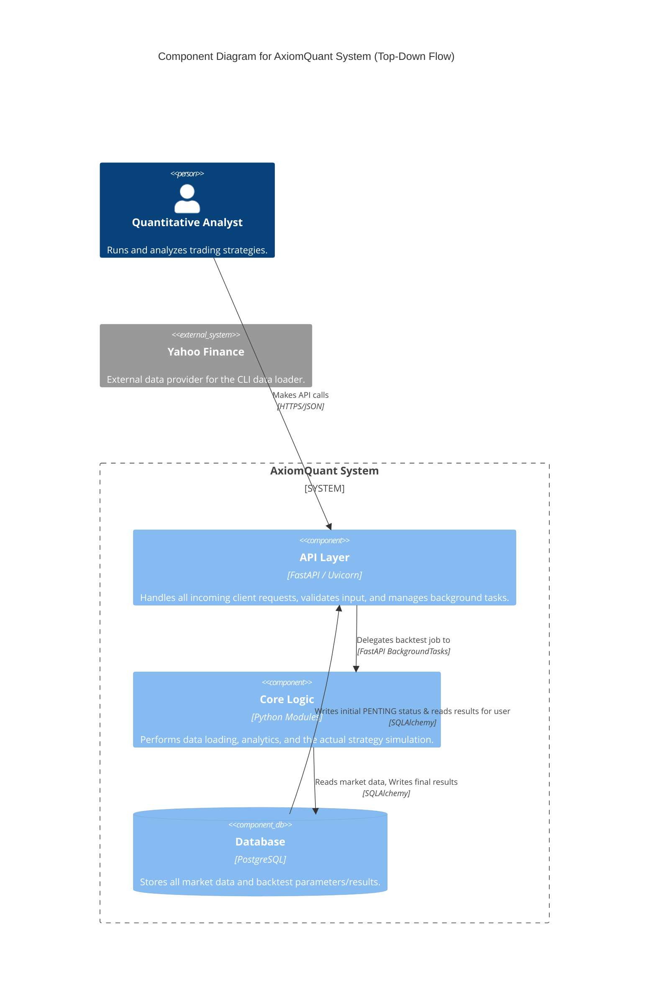
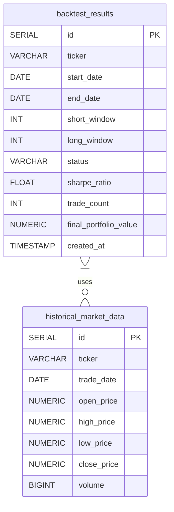
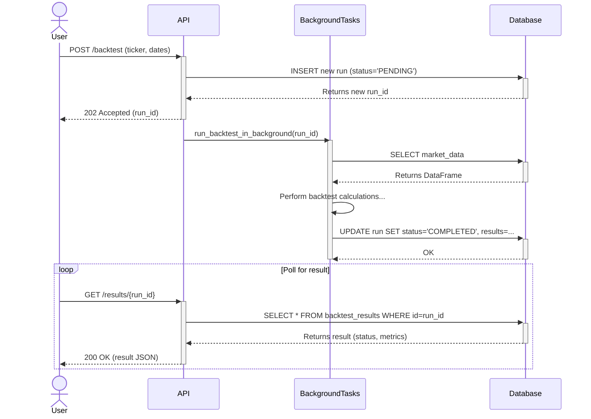
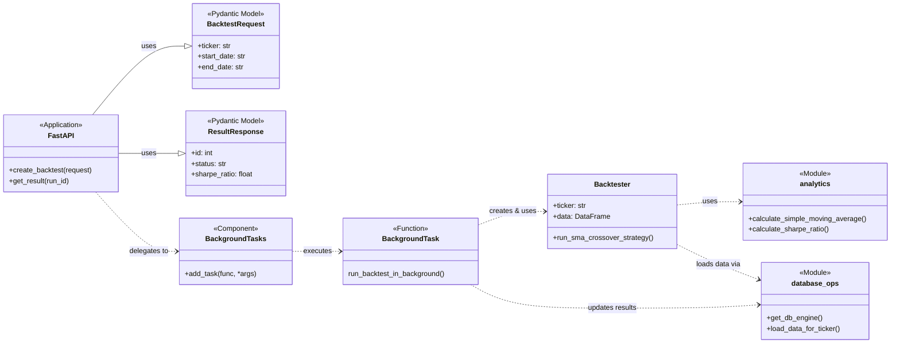

# AxiomQuant

A Dockerized Python framework for robust quantitative strategy backtesting and performance analysis.

AxiomQuant is an end-to-end Python application designed to simulate, test, and analyze quantitative trading strategies for the equity markets. It provides a complete, containerized environment for repeatable research, from automated data ingestion pipelines to sophisticated performance analytics. Built with modern software engineering practices including CI/CD, containerization, and comprehensive testing, this project serves as a robust framework for rigorous quantitative research.

---

## Core Technologies

This project is built with a modern, production-ready Python stack:

*   **Backend Framework:** FastAPI
*   **Data Analysis:** Pandas, NumPy, SciPy
*   **Database:** PostgreSQL with SQLAlchemy
*   **Containerization:** Docker & Docker Compose
*   **CI/CD:** GitHub Actions
*   **Testing:** Pytest
*   **Code Quality:** Ruff & Black
*   **Configuration:** `python-dotenv`

---

## Features

### Core Functionality
- **Automated Data Ingestion:** A CLI-driven pipeline to fetch historical market data from Yahoo Finance and store it in a PostgreSQL database.
- **Quantitative Analytics Engine:** A set of pure, unit-tested functions for calculating key metrics like Simple Moving Averages and Sharpe Ratio.
- **Backtesting Framework:** A robust `Backtester` class that simulates a Simple Moving Average (SMA) Crossover strategy.
- **Asynchronous API:** A high-performance FastAPI server that runs backtests as background tasks, preventing HTTP timeouts and ensuring a responsive user experience.
- **Results Persistence:** All backtest parameters and performance results are automatically saved to the database.

### DevOps & Engineering
- **Containerized Environment:** The entire application stack (Python app, database) is managed by Docker Compose for consistent, portable development.
- **Automated CI/CD Pipeline:** Every push to GitHub triggers a workflow that automatically lints, formats, and runs the full suite of unit and integration tests against a live database service.
- **Comprehensive Testing:** The project boasts a full test suite, including:
    - **Unit Tests** for pure business logic.
    - **Integration Tests** that validate the live API endpoints and database interactions.
- **Configuration Management:** All credentials and settings are externalized from the code into a `.env` file for security and portability.

---

## How to Use

### Prerequisites
- Docker and Docker Compose installed
- Python 3.12+ and a virtual environment manager

### 1. Initial Setup

Clone the repository and set up the local environment.

```bash
# Clone the repository
git clone https://github.com/zhu-weijie/axiom-quant.git
cd axiom-quant

# Create a virtual environment and activate it
python3 -m venv .venv
source .venv/bin/activate

# Install dependencies
pip install -r requirements.txt

# Create your local environment file
cp .env.example .env

# IMPORTANT: For local testing, change the host in your .env file
# From: POSTGRES_HOST=db
# To:   POSTGRES_HOST=localhost
```

### 2. Running the Application

Start the entire application stack (API server and database) with a single command.

```bash
docker compose up --build -d
```
The API is now available at `http://localhost:8000`. You can view the interactive documentation at `http://localhost:8000/docs`.

### 3. Example Workflow

Interact with the application from your terminal.

#### Step A: Load Historical Data

Run the data ingestion pipeline for a few tickers.

```bash
docker compose exec app python -m axiomquant --tickers AAPL NVDA --period 3y
```

#### Step B: Start a Backtest

Use `curl` to send a request to the `/backtest` endpoint.

```bash
curl -X 'POST' \
  'http://localhost:8000/backtest' \
  -H 'Content-Type: application/json' \
  -d '{
    "ticker": "AAPL",
    "start_date": "2023-01-01",
    "end_date": "2024-12-31",
    "short_window": 50,
    "long_window": 200
  }'
```
You will receive an instant response with a `run_id`, for example:
```json
{
  "message": "Backtest run started",
  "run_id": 1
}
```

#### Step C: Check the Results

After a few seconds, use the `run_id` to retrieve the results of the completed backtest.

```bash
curl http://localhost:8000/results/1
```
The response will contain the full performance details:
```json
{
  "id": 1,
  "ticker": "AAPL",
  "start_date": "2023-01-01",
  "end_date": "2024-12-31",
  "short_window": 50,
  "long_window": 200,
  "status": "COMPLETED",
  "sharpe_ratio": 0.036,
  "trade_count": 2,
  "final_portfolio_value": 100000.72
}
```

### 4. Running Tests

To run the full test suite, including integration tests, make sure your Docker services are running and then execute `pytest`.

```bash
# Ensure services are running
docker compose up -d

# Run the test suite
pytest
```

## Design Diagrams

### C4 Component Diagram



### Entity Relationship Diagram



### Triggering an Asynchronous Backtest



### Class Diagram


