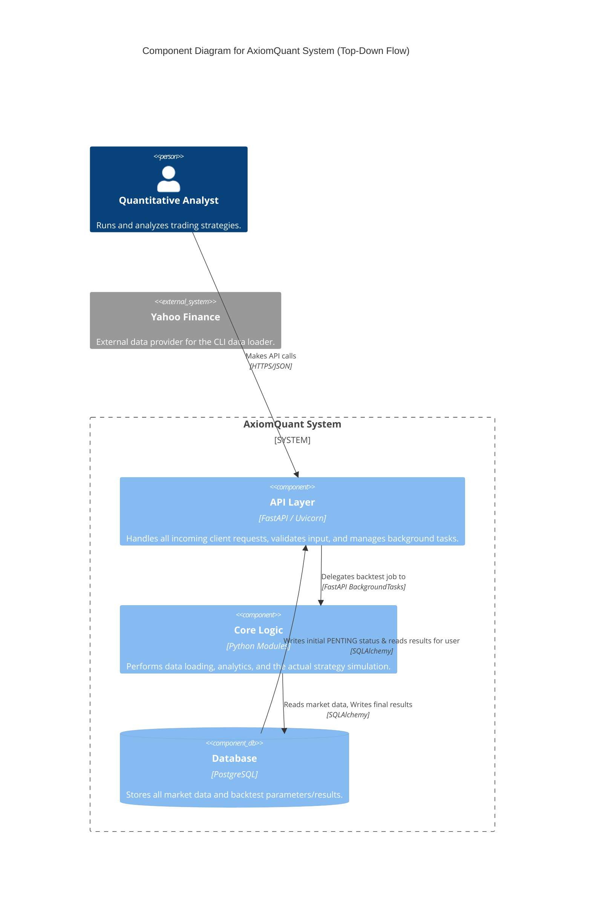

```mermaid
C4Component
    title Component Diagram for AxiomQuant System (Top-Down Flow)

    Person(user, "Quantitative Analyst", "Runs and analyzes trading strategies.")

    System_Ext(yf, "Yahoo Finance", "External data provider for the CLI data loader.")

    System_Boundary(c1, "AxiomQuant System") {
        Component(api, "API Layer", "FastAPI / Uvicorn", "Handles all incoming client requests, validates input, and manages background tasks.")
        Component(worker, "Core Logic", "Python Modules", "Performs data loading, analytics, and the actual strategy simulation.")
        ComponentDb(db, "Database", "PostgreSQL", "Stores all market data and backtest parameters/results.")
    }
    
    Rel_Down(user, api, "Makes API calls", "HTTPS/JSON")
    Rel_Down(api, worker, "Delegates backtest job to", "FastAPI BackgroundTasks")
    
    %% The API writes the initial PENDING status, but the worker does the main R/W operations
    Rel(worker, db, "Reads market data, Writes final results", "SQLAlchemy")
    Rel_Back(api, db, "Writes initial PENTING status & reads results for user", "SQLAlchemy")
```
