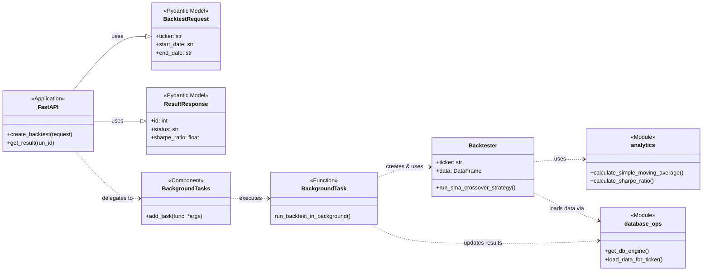

```mermaid
classDiagram
    direction LR

    class FastAPI {
        <<Application>>
        +create_backtest(request)
        +get_result(run_id)
    }
    class BackgroundTasks {
        <<Component>>
        +add_task(func, *args)
    }
    class BackgroundTask {
        <<Function>>
        run_backtest_in_background()
    }
    class BacktestRequest {
        <<Pydantic Model>>
        +ticker: str
        +start_date: str
        +end_date: str
    }
    class ResultResponse {
        <<Pydantic Model>>
        +id: int
        +status: str
        +sharpe_ratio: float
    }
    class Backtester {
        +ticker: str
        +data: DataFrame
        +run_sma_crossover_strategy()
    }
    class analytics {
        <<Module>>
        +calculate_simple_moving_average()
        +calculate_sharpe_ratio()
    }
    class database_ops {
        <<Module>>
        +get_db_engine()
        +load_data_for_ticker()
    }

    FastAPI --|> BacktestRequest : uses
    FastAPI --|> ResultResponse : uses
    FastAPI ..> BackgroundTasks : delegates to
    BackgroundTasks ..> BackgroundTask : executes
    BackgroundTask ..> Backtester : creates & uses
    BackgroundTask ..> database_ops : updates results
    Backtester ..> analytics : uses
    Backtester ..> database_ops : loads data via
```
