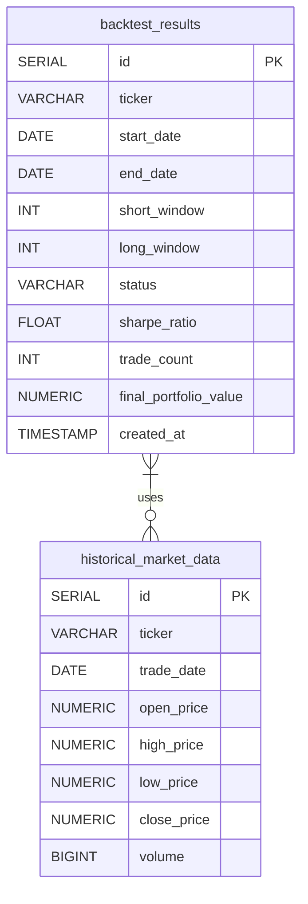

```mermaid
erDiagram
    historical_market_data {
        SERIAL id PK
        VARCHAR ticker
        DATE trade_date
        NUMERIC open_price
        NUMERIC high_price
        NUMERIC low_price
        NUMERIC close_price
        BIGINT volume
    }

    backtest_results {
        SERIAL id PK
        VARCHAR ticker
        DATE start_date
        DATE end_date
        INT short_window
        INT long_window
        VARCHAR status
        FLOAT sharpe_ratio
        INT trade_count
        NUMERIC final_portfolio_value
        TIMESTAMP created_at
    }

    backtest_results }|--o{ historical_market_data : "uses"
```
