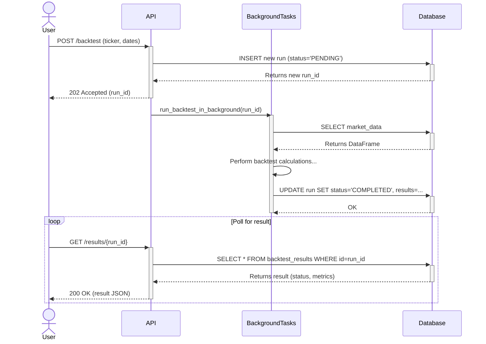

```mermaid
sequenceDiagram
    actor User
    participant API
    participant BackgroundTasks
    participant Database

    User->>+API: POST /backtest (ticker, dates)
    API->>+Database: INSERT new run (status='PENDING')
    Database-->>-API: Returns new run_id
    API-->>-User: 202 Accepted (run_id)

    API->>BackgroundTasks: run_backtest_in_background(run_id)
    activate BackgroundTasks
    
    BackgroundTasks->>+Database: SELECT market_data
    Database-->>-BackgroundTasks: Returns DataFrame
    
    BackgroundTasks->>BackgroundTasks: Perform backtest calculations...
    
    BackgroundTasks->>+Database: UPDATE run SET status='COMPLETED', results=...
    Database-->>-BackgroundTasks: OK
    deactivate BackgroundTasks
    
    loop Poll for result
        User->>+API: GET /results/{run_id}
        API->>+Database: SELECT * FROM backtest_results WHERE id=run_id
        Database-->>-API: Returns result (status, metrics)
        API-->>-User: 200 OK (result JSON)
    end
```
